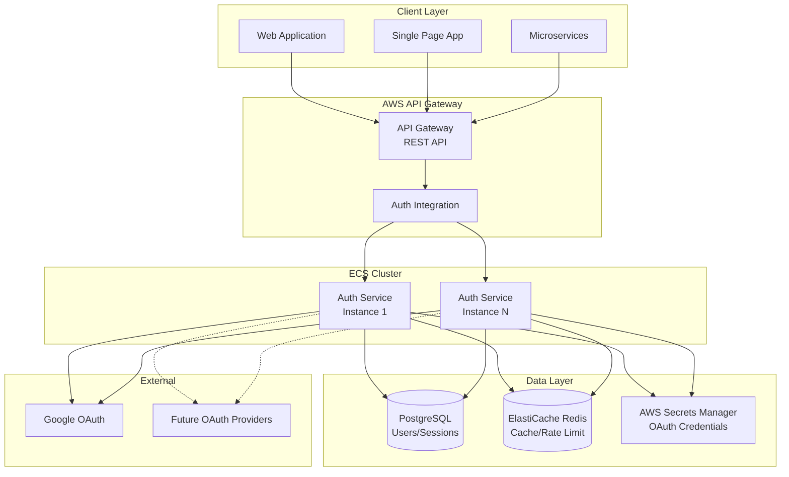
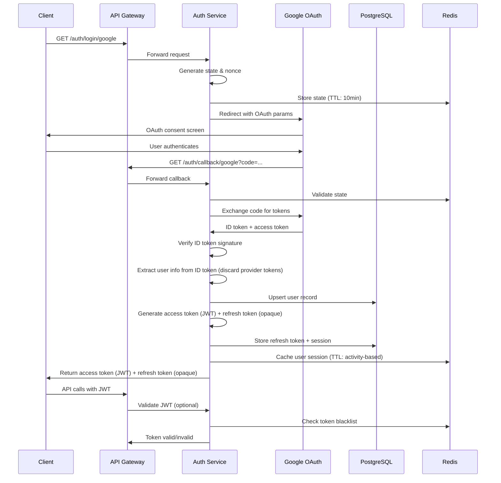
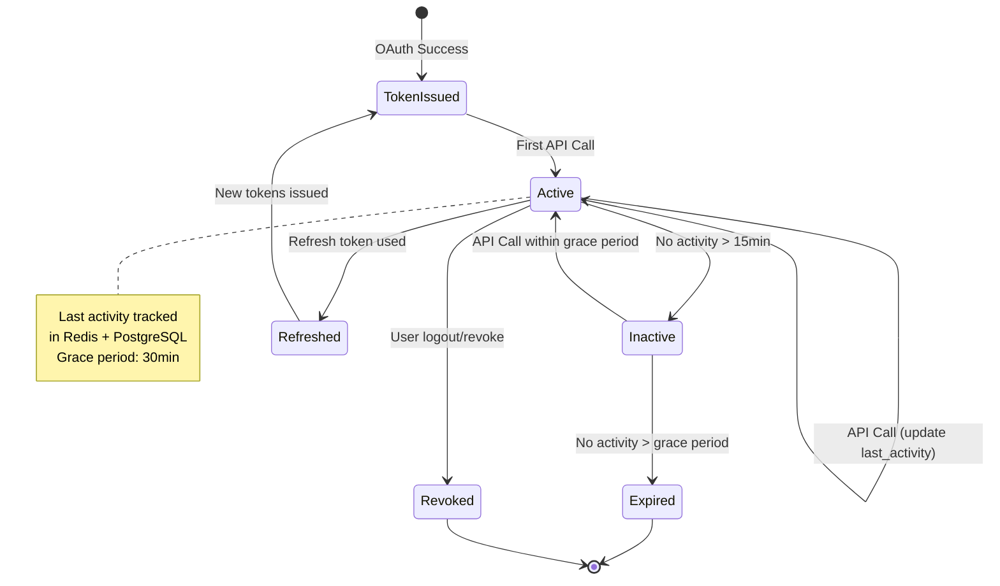

# Technical Plan: OAuth Authentication Microservice

> **Quick Integration Guide**: For AI agents and developers integrating this auth service into other microservices, see **[docs/INTEGRATION.md](docs/INTEGRATION.md)**.

## Executive Summary

This document outlines a comprehensive technical plan for building a secure, scalable OAuth authentication microservice using **Node.js/TypeScript**. The service will be API-first, AI-agent friendly, and designed for seamless integration into a microservice architecture with AWS API Gateway and ECS.

**Technology Stack Decision: Node.js/TypeScript** ✅
- Industry standard for auth services (Auth0, Okta patterns)
- Excellent async performance for high throughput
- Strong OAuth ecosystem (Passport.js)
- TypeScript for type safety and better AI agent interaction
- Fast development iteration
- Great for API services

---

## Architecture Overview

### System Architecture Diagram



### Authentication Flow



### Token Lifecycle with Activity Tracking



---

## Technology Stack

### Core Framework
- **Runtime**: Node.js 20.x LTS
- **Language**: TypeScript 5.x
- **Framework**: **Express.js** (lightweight, flexible) OR **Nest.js** (more structure, decorators)
  - **Recommendation**: Express.js for simplicity, but Nest.js if you want more opinionated structure
- **API Style**: **REST** (primary) with OpenAPI 3.0 specification
  - **MCP Consideration**: MCP (Model Context Protocol) is primarily for AI-to-tool communication, not HTTP APIs. For API-first design, REST with OpenAPI is standard and AI-agent friendly via OpenAPI specs.

### OAuth & Authentication
- **OAuth Library**: Passport.js with passport-google-oauth20
- **JWT**: jsonwebtoken + jwks-rsa (for key rotation)
- **Token Storage**: PostgreSQL (refresh tokens) + Redis (blacklist/activity)

### Database & Caching
- **Database**: PostgreSQL 15+ (RDS)
- **Database Access**: **Kysely** (SQL-first, type-safe query builder, minimal abstraction)
  - **Rationale**: Auth service is latency-critical and security-sensitive. SQL-first approach provides:
    - ✅ **Predictable query performance** - No ORM runtime overhead, direct SQL control
    - ✅ **Full SQL visibility** - All queries are explicit and auditable for security/compliance
    - ✅ **Type safety** - TypeScript types without abstraction complexity
    - ✅ **Better performance on hot paths** - Critical for authentication endpoints
    - ✅ **Microservice best practice** - Services own their databases, expose APIs (not shared ORM schemas)
    - ✅ **Easier debugging** - See exactly what SQL is executed
    - ✅ **Simpler auditing** - Full visibility of database operations for SOC2/GDPR compliance
- **Migrations**: SQL migration files (using `node-pg-migrate` or similar)
- **Caching**: Redis (ElastiCache) for:
  - Token blacklisting
  - Rate limiting
  - Session activity tracking
  - OAuth state storage

### Infrastructure
- **Compute**: AWS ECS Fargate
- **API Gateway**: AWS API Gateway (REST API)
- **Load Balancer**: Application Load Balancer (behind API Gateway)
- **Secrets**: AWS Secrets Manager
- **IaC**: **Terraform** (recommended) or AWS CDK
- **Container Registry**: Amazon ECR

### Development & Quality
- **Testing**: Jest + Supertest
- **Linting**: ESLint + Prettier
- **Type Checking**: TypeScript compiler
- **API Docs**: OpenAPI/Swagger (auto-generated from code)
- **CI/CD**: GitHub Actions

### Observability
- **Logging**: Winston (structured JSON logging)
- **Monitoring**: CloudWatch Metrics + Logs
- **Tracing**: AWS X-Ray (optional)

---

## Project Structure

```
auth-service/
├── .cursorrules                    # Cursor AI rules
├── .github/
│   └── workflows/
│       ├── ci-cd.yml               # CI/CD pipeline (tests, builds, deploys)
│       └── infrastructure.yml      # Infrastructure pipeline (Terraform)
├── docs/
│   ├── architecture.md             # Architecture docs
│   ├── api/
│   │   └── openapi.yaml            # OpenAPI specification
│   └── diagrams/
│       └── architecture.mmd         # Mermaid diagrams
├── infrastructure/
│   ├── terraform/
│   │   ├── main.tf                 # Main Terraform config
│   │   ├── variables.tf
│   │   ├── outputs.tf
│   │   ├── modules/
│   │   │   ├── ecs/
│   │   │   ├── api-gateway/
│   │   │   ├── rds/
│   │   │   └── redis/
│   │   └── environments/
│   │       ├── dev/
│   │       └── prod/
│   └── docker/
│       └── Dockerfile
├── src/
│   ├── app.ts                      # Express app setup
│   ├── server.ts                   # Server entry point
│   ├── config/
│   │   ├── index.ts                # Configuration management
│   │   ├── database.ts             # DB config
│   │   └── redis.ts                # Redis config
│   ├── api/
│   │   ├── v1/
│   │   │   ├── routes/
│   │   │   │   ├── auth.routes.ts  # Auth endpoints
│   │   │   │   ├── token.routes.ts # Token management
│   │   │   │   └── user.routes.ts  # User endpoints
│   │   │   ├── controllers/
│   │   │   │   ├── auth.controller.ts
│   │   │   │   ├── token.controller.ts
│   │   │   │   └── user.controller.ts
│   │   │   └── validators/
│   │   │       └── schemas.ts      # Request validation schemas (Zod)
│   │   └── middleware/
│   │       ├── auth.middleware.ts  # JWT validation
│   │       ├── rateLimit.middleware.ts
│   │       ├── errorHandler.middleware.ts
│   │       └── logger.middleware.ts
│   ├── services/
│   │   ├── oauth/
│   │   │   ├── oauth.service.ts    # OAuth orchestration
│   │   │   ├── providers/
│   │   │   │   ├── base.provider.ts # Base interface
│   │   │   │   ├── google.provider.ts
│   │   │   │   ├── google-jwks.service.ts # Google ID token verification
│   │   │   │   └── provider.factory.ts
│   │   ├── token/
│   │   │   ├── token.service.ts    # JWT generation/validation
│   │   │   └── activity.service.ts # Activity tracking
│   │   ├── user/
│   │   │   └── user.service.ts     # User management (service layer)
│   │   └── audit/
│   │       └── audit.service.ts    # Audit logging
│   ├── database/
│   │   ├── migrations/              # SQL migration files
│   │   │   ├── 001_create_users.sql
│   │   │   ├── 002_create_sessions.sql
│   │   │   └── ...
│   │   ├── schema.ts                # Kysely type definitions
│   │   ├── client.ts                # Kysely database client
│   │   └── repositories/            # Repository pattern for data access
│   │       ├── user.repository.ts
│   │       ├── session.repository.ts
│   │       └── audit.repository.ts
│   ├── types/
│   │   ├── database.types.ts        # Database table types (from Kysely)
│   │   ├── auth.types.ts
│   │   ├── token.types.ts
│   │   └── api.types.ts
│   └── utils/
│       ├── aws-secrets.ts          # AWS Secrets Manager
│       ├── logger.ts               # Winston logger
│       ├── errors.ts               # Custom error classes
│       └── crypto.ts               # Crypto utilities
├── tests/
│   ├── unit/
│   │   ├── services/
│   │   ├── controllers/
│   │   └── utils/
│   ├── integration/
│   │   ├── auth.test.ts
│   │   └── token.test.ts
│   └── e2e/
│       └── auth-flow.test.ts
├── .env.example
├── .gitignore
├── .eslintrc.js
├── .prettierrc
├── docker-compose.yml               # Local development
├── Dockerfile
├── package.json
├── tsconfig.json
├── jest.config.js
└── README.md
```

---

## Database Schema Design

### SQL-First Approach with Kysely

We use **SQL migrations** for schema management and **Kysely** for type-safe query building. This provides:
- Full SQL visibility for auditing and debugging
- Predictable query performance
- No ORM runtime overhead
- Type safety through Kysely's TypeScript integration

### SQL Schema (Migration Files)

#### Migration: 001_create_users.sql

```sql
-- Create users table
CREATE TABLE users (
  id TEXT PRIMARY KEY DEFAULT gen_random_uuid()::text,
  email TEXT NOT NULL UNIQUE,
  name TEXT,
  picture TEXT,
  provider TEXT NOT NULL,
  provider_id TEXT NOT NULL,
  created_at TIMESTAMP WITH TIME ZONE NOT NULL DEFAULT NOW(),
  updated_at TIMESTAMP WITH TIME ZONE NOT NULL DEFAULT NOW(),
  last_activity_at TIMESTAMP WITH TIME ZONE
);

-- Indexes
CREATE INDEX idx_users_email ON users(email);
CREATE INDEX idx_users_provider_provider_id ON users(provider, provider_id);

-- Updated_at trigger
CREATE OR REPLACE FUNCTION update_updated_at_column()
RETURNS TRIGGER AS $$
BEGIN
  NEW.updated_at = NOW();
  RETURN NEW;
END;
$$ LANGUAGE plpgsql;

CREATE TRIGGER update_users_updated_at
  BEFORE UPDATE ON users
  FOR EACH ROW
  EXECUTE FUNCTION update_updated_at_column();
```

#### Migration: 002_create_sessions.sql

```sql
-- Create sessions table
-- Note: Sessions represent logical login contexts; refresh tokens represent credentials used to extend those sessions.
CREATE TABLE sessions (
  id TEXT PRIMARY KEY DEFAULT gen_random_uuid()::text,
  user_id TEXT NOT NULL REFERENCES users(id) ON DELETE CASCADE,
  access_token_jti TEXT NOT NULL UNIQUE, -- JWT ID (jti claim), not the full token
  expires_at TIMESTAMP WITH TIME ZONE NOT NULL,
  last_activity_at TIMESTAMP WITH TIME ZONE NOT NULL DEFAULT NOW(),
  revoked_at TIMESTAMP WITH TIME ZONE,
  ip_address TEXT,
  user_agent TEXT,
  created_at TIMESTAMP WITH TIME ZONE NOT NULL DEFAULT NOW()
);

-- Indexes
CREATE INDEX idx_sessions_user_id ON sessions(user_id);
CREATE INDEX idx_sessions_access_token_jti ON sessions(access_token_jti);
CREATE INDEX idx_sessions_expires_at ON sessions(expires_at);
```

#### Migration: 003_create_refresh_tokens.sql

```sql
-- Create refresh_tokens table
-- Refresh tokens are first-class credentials linked to sessions
-- They are rotated on every use and stored independently from sessions
CREATE TABLE refresh_tokens (
  id TEXT PRIMARY KEY DEFAULT gen_random_uuid()::text,
  session_id TEXT NOT NULL REFERENCES sessions(id) ON DELETE CASCADE,
  user_id TEXT NOT NULL REFERENCES users(id) ON DELETE CASCADE,
  token TEXT NOT NULL UNIQUE,
  expires_at TIMESTAMP WITH TIME ZONE NOT NULL,
  revoked_at TIMESTAMP WITH TIME ZONE,
  last_used_at TIMESTAMP WITH TIME ZONE, -- Track last usage for inactivity enforcement
  created_at TIMESTAMP WITH TIME ZONE NOT NULL DEFAULT NOW()
);

-- Indexes
CREATE INDEX idx_refresh_tokens_session_id ON refresh_tokens(session_id);
CREATE INDEX idx_refresh_tokens_user_id ON refresh_tokens(user_id);
CREATE INDEX idx_refresh_tokens_token ON refresh_tokens(token);
CREATE INDEX idx_refresh_tokens_expires_at ON refresh_tokens(expires_at);
CREATE INDEX idx_refresh_tokens_last_used_at ON refresh_tokens(last_used_at);
```

**Refresh Token Inactivity Enforcement:**
- Refresh tokens update `last_used_at` on each successful rotation
- Tokens exceeding inactivity thresholds (> 7 days) are revoked by scheduled cleanup job
- This ensures refresh tokens are automatically cleaned up when inactive

#### Migration: 004_create_audit_logs.sql

```sql
-- Create audit_logs table
CREATE TABLE audit_logs (
  id TEXT PRIMARY KEY DEFAULT gen_random_uuid()::text,
  user_id TEXT REFERENCES users(id) ON DELETE SET NULL,
  action TEXT NOT NULL, -- 'login', 'logout', 'token_refresh', 'token_revoke'
  provider TEXT,
  ip_address TEXT,
  user_agent TEXT,
  success BOOLEAN NOT NULL,
  error_message TEXT,
  metadata JSONB,
  created_at TIMESTAMP WITH TIME ZONE NOT NULL DEFAULT NOW()
);

-- Indexes
CREATE INDEX idx_audit_logs_user_id ON audit_logs(user_id);
CREATE INDEX idx_audit_logs_action ON audit_logs(action);
CREATE INDEX idx_audit_logs_created_at ON audit_logs(created_at);
```

### Kysely Type Definitions

```typescript
// src/database/schema.ts
import { ColumnType } from 'kysely';

export interface Database {
  users: UserTable;
  sessions: SessionTable;
  refresh_tokens: RefreshTokenTable;
  audit_logs: AuditLogTable;
}

export interface UserTable {
  id: string;
  email: string;
  name: string | null;
  picture: string | null;
  provider: string;
  provider_id: string;
  created_at: Date;
  updated_at: Date;
  last_activity_at: Date | null;
}

export interface SessionTable {
  id: string;
  user_id: string;
  access_token_jti: string; // JWT ID (jti claim), not the full token
  expires_at: Date;
  last_activity_at: Date;
  revoked_at: Date | null;
  ip_address: string | null;
  user_agent: string | null;
  created_at: Date;
}

export interface RefreshTokenTable {
  id: string;
  session_id: string; // Links refresh token to session
  user_id: string;
  token: string; // Opaque refresh token (first-class credential)
  expires_at: Date;
  revoked_at: Date | null;
  last_used_at: Date | null; // Track last usage for inactivity enforcement
  created_at: Date;
}

export interface AuditLogTable {
  id: string;
  user_id: string | null;
  action: string;
  provider: string | null;
  ip_address: string | null;
  user_agent: string | null;
  success: boolean;
  error_message: string | null;
  metadata: Record<string, unknown> | null;
  created_at: Date;
}
```

### Database Client Setup

```typescript
// src/database/client.ts
import { Kysely, PostgresDialect } from 'kysely';
import { Pool } from 'pg';
import type { Database } from './schema';

// Connection pool configuration
// - max: Maximum connections per instance (scales with ECS instances)
// - min: Minimum idle connections (reduces connection overhead)
// - idleTimeoutMillis: Close idle connections after 30s
// - connectionTimeoutMillis: Fail fast if connection unavailable
const dialect = new PostgresDialect({
  pool: new Pool({
    connectionString: process.env.DATABASE_URL,
    max: parseInt(process.env.DB_POOL_MAX || '20', 10), // Per instance
    min: parseInt(process.env.DB_POOL_MIN || '5', 10),
    idleTimeoutMillis: 30000,
    connectionTimeoutMillis: 5000,
    // Separate read/write pools can be configured if needed
  }),
});

export const db = new Kysely<Database>({
  dialect,
});

// Read pool (optional, for read replicas)
export const readDb = process.env.READ_REPLICA_URL
  ? new Kysely<Database>({
      dialect: new PostgresDialect({
        pool: new Pool({
          connectionString: process.env.READ_REPLICA_URL,
          max: parseInt(process.env.DB_READ_POOL_MAX || '10', 10),
          min: 2,
        }),
      }),
    })
  : db;
```

**Connection Pool Sizing:**
- **Per-instance pool**: 20 connections max (configurable via env)
- **Total capacity**: Pool size × ECS instance count
- **Burst handling**: Connection pool + RDS connection limit monitoring
- **Read replicas**: Optional read pool for read-heavy operations (future)

### Repository Pattern Example

```typescript
// src/database/repositories/user.repository.ts
import { db } from '../client';
import type { UserTable } from '../schema';

export class UserRepository {
  async findByEmail(email: string): Promise<UserTable | undefined> {
    return db
      .selectFrom('users')
      .selectAll()
      .where('email', '=', email)
      .executeTakeFirst();
  }

  async upsertUser(user: {
    email: string;
    name: string | null;
    picture: string | null;
    provider: string;
    provider_id: string;
  }): Promise<UserTable> {
    return db
      .insertInto('users')
      .values({
        ...user,
        created_at: new Date(),
        updated_at: new Date(),
      })
      .onConflict((oc) =>
        oc.column('email').doUpdateSet({
          name: (eb) => eb.ref('excluded.name'),
          picture: (eb) => eb.ref('excluded.picture'),
          updated_at: new Date(),
        })
      )
      .returningAll()
      .executeTakeFirstOrThrow();
  }
}
```

### Compliance Considerations

The schema supports:
- **SOC2**: Audit logging with user actions, IP addresses, timestamps
- **GDPR**: User data can be exported/deleted via user ID
- **Financial Compliance**: Complete audit trail of authentication events

### Audit Logging & Compliance

#### Audit Log Retention Policy

```typescript
// Audit log retention configuration
const AUDIT_RETENTION = {
  PRODUCTION: {
    HOT_STORAGE: 90, // days in PostgreSQL
    COLD_STORAGE: 2555, // days (7 years) in S3/Glacier
    ARCHIVAL_THRESHOLD: 90, // Archive after 90 days
  },
  DEVELOPMENT: {
    HOT_STORAGE: 30,
    COLD_STORAGE: 90,
    ARCHIVAL_THRESHOLD: 30,
  },
};
```

**Retention Strategy:**
- **Hot storage (PostgreSQL)**: 90 days (configurable)
- **Cold storage (S3/Glacier)**: 7 years (financial compliance)
- **Archival process**: Automated job moves logs > 90 days to S3
- **Deletion policy**: GDPR deletion requests remove from both hot and cold storage

#### Audit Logging Failure Behavior

**Fail-Open Strategy (Recommended for Auth Service):**
- **Rationale**: Authentication should not fail due to audit logging issues
- **Implementation**: Audit logging is asynchronous and non-blocking
- **Failure handling**: 
  - Log audit failures to application logs (CloudWatch)
  - Retry failed audit writes with exponential backoff
  - Alert on persistent audit failures (SNS/CloudWatch alarms)

```typescript
async function logAuditEvent(event: AuditEvent): Promise<void> {
  try {
    // Non-blocking audit write
    await db
      .insertInto('audit_logs')
      .values(event)
      .execute();
  } catch (error) {
    // Log failure but don't block authentication
    logger.error('Audit logging failed', { error, event });
    // Optional: Queue for retry (SQS)
    await auditRetryQueue.send(event);
  }
}
```

**Audit Log Schema:**
- All authentication events logged (login, logout, token refresh, revocation)
- Includes: user ID, IP address, user agent, timestamp, success/failure, error messages
- Metadata field for extensible context (JSONB)

---

## API Design

### REST API Endpoints

#### Authentication Endpoints

```
GET  /api/v1/auth/login/{provider}
     - Initiate OAuth flow
     - Returns: Redirect to OAuth provider
     - Query params: redirect_uri (optional)

GET  /api/v1/auth/callback/{provider}
     - OAuth callback handler
     - Returns: access token (JWT) + refresh token (opaque)
     - Response: { accessToken, refreshToken, expiresIn, user }
     - Security: Provider tokens (Google access token) are used only for identity verification and then discarded. Only service-issued tokens are used for downstream authentication.

POST /api/v1/auth/logout
     - Revoke current session
     - Headers: Authorization: Bearer {token}
     - Returns: 204 No Content

POST /api/v1/auth/logout/all
     - Revoke all user sessions
     - Headers: Authorization: Bearer {token}
     - Returns: 204 No Content
```

#### Token Management

```
POST /api/v1/auth/token/refresh
     - Refresh access token
     - Body: { refreshToken }
     - Returns: { accessToken (JWT), refreshToken (opaque), expiresIn }

POST /api/v1/auth/token/validate
     - Validate access token (JWT) (introspection endpoint)
     - Body: { token }
     - Returns: { valid, user, expiresAt } or 401
     - Note: Downstream services should validate JWTs locally using JWKS endpoint
     - Use case: Debugging, admin workflows, or services that cannot manage public keys
     - Important: This endpoint is not intended for per-request validation in high-throughput paths
     - Security: This endpoint is restricted to internal services or admin contexts (IAM, VPC, or mTLS), not public clients

GET  /api/v1/.well-known/jwks.json
     - JSON Web Key Set (JWKS) endpoint for JWT public keys
     - Returns: { keys: [...] } (RSA public keys for token validation)
     - Cache-Control: public, max-age=600 (10 minutes)
     - Use case: Downstream services fetch and cache public keys for local JWT validation

GET  /api/v1/auth/token/info
     - Get current token info
     - Headers: Authorization: Bearer {token}
     - Returns: { userId, expiresAt, lastActivityAt }
```

#### User Endpoints

```
GET  /api/v1/auth/me
     - Get current user profile
     - Headers: Authorization: Bearer {token}
     - Returns: { id, email, name, picture, provider }

GET  /api/v1/auth/sessions
     - List user's active sessions
     - Headers: Authorization: Bearer {token}
     - Returns: Array of session objects
```

#### Health & Status

```
GET  /health
     - Health check (for load balancer)
     - Returns: { status: "ok", timestamp }

GET  /ready
     - Readiness check (database, Redis connectivity)
     - Returns: { status: "ready", checks: {...} }
```

### OpenAPI Specification

All endpoints will be documented in `docs/api/openapi.yaml` following OpenAPI 3.0 specification. This enables:
- Auto-generated API documentation
- Client SDK generation
- AI agent understanding via OpenAPI specs
- Integration with API Gateway for request validation

---

## JWT Token Strategy

### Token Structure

**Access Token (JWT)**
- **Algorithm**: RS256 (asymmetric, allows independent validation)
- **Expiration**: 15 minutes
- **Claims**:
  ```json
  {
    "sub": "user_id",
    "email": "user@example.com",
    "provider": "google",
    "iat": 1234567890,
    "exp": 1234568790,
    "jti": "token_id", // For blacklisting and activity tracking
    "sid": "session_id" // Optional: Session ID for clearer revocation and debugging
  }
  ```

**Refresh Token**
- **Type**: Opaque token (stored in database)
- **Expiration**: 30 days
- **Activity-based**: Extended on use, revoked if inactive > 7 days
- **Rotation**: Refresh tokens are rotated on every successful use; previous refresh tokens are immediately revoked to prevent replay attacks

**Session vs Token Lifetime:**
- **Sessions represent long-lived login contexts and always outlive individual access tokens.**
- Access tokens expire frequently (15 minutes); sessions expire based on inactivity or explicit revocation.
- Multiple access tokens can be issued for the same session via refresh token rotation.

### Activity Tracking Implementation

```typescript
// Activity tracking logic
const INACTIVITY_THRESHOLD = 15 * 60 * 1000; // 15 minutes
const GRACE_PERIOD = 30 * 60 * 1000; // 30 minutes
const MAX_INACTIVITY = 7 * 24 * 60 * 60 * 1000; // 7 days

// On each API call:
1. Check last_activity_at in Redis (session-scoped using sid)
2. If last_activity_at < (now - INACTIVITY_THRESHOLD):
   - Token is "inactive" but still valid within grace period
3. If last_activity_at < (now - GRACE_PERIOD):
   - Token is expired, require refresh
4. Update last_activity_at in Redis using session ID: `activity:${sid}` (TTL: GRACE_PERIOD)
   - Activity tracking is session-scoped (sid) rather than token-scoped, ensuring refresh cycles do not fragment session state
5. Update last_activity_at in PostgreSQL periodically (e.g., once per N minutes or on token refresh/logout)
   - Redis = real-time activity tracking
   - PostgreSQL = coarse-grained audit trail
```

### Token Revocation Model

#### Stateless vs Stateful Token Validation

**Access Tokens (Stateless JWT with Blacklist Check)**
- **Primary validation**: Stateless JWT signature verification (RS256)
- **Revocation check**: Redis blacklist lookup by `jti` (JWT ID)
- **Revocation guarantee**: **Immediate** (within Redis propagation time, ~1-5ms)
- **Tradeoff**: Short-lived tokens (15 min) minimize revocation window

**Refresh Tokens (Stateful)**
- **Storage**: PostgreSQL database
- **Revocation**: Immediate via database update
- **Propagation**: Instant (database is source of truth)

#### Revocation Implementation

```typescript
// Token revocation flow
async function revokeToken(jti: string, expiresAt: Date): Promise<void> {
  // 1. Add to Redis blacklist (immediate effect)
  await redis.setex(`blacklist:${jti}`, 
    Math.max(0, Math.floor((expiresAt.getTime() - Date.now()) / 1000)),
    '1'
  );
  
  // 2. Update database session (for audit)
  await db
    .updateTable('sessions')
    .set({ revoked_at: new Date() })
    .where('access_token_jti', '=', jti)
    .execute();
}

// Token validation with blacklist check
async function validateToken(token: string): Promise<boolean> {
  // 1. Verify JWT signature (stateless)
  const decoded = jwt.verify(token, publicKey, { algorithms: ['RS256'] });
  
  // 2. Check blacklist (stateful check)
  const blacklisted = await redis.exists(`blacklist:${decoded.jti}`);
  if (blacklisted) {
    return false; // Revoked
  }
  
  // 3. Check activity (optional, for grace period)
  // Use sid (session ID) for session-scoped activity tracking
  // Activity tracking is session-scoped rather than token-scoped
  const sessionId = decoded.sid || decoded.jti; // Prefer sid, fallback to jti
  const lastActivity = await redis.get(`activity:${sessionId}`);
  // ... activity validation logic
  
  return true;
}
```

#### Revocation-Triggering Events

| Event | Time-to-Effect | Mechanism |
|-------|---------------|-----------|
| User logout | Immediate (< 5ms) | Redis blacklist + DB update |
| User logout all | Immediate (< 5ms) | Batch Redis blacklist + DB update |
| Credential reset / Identity re-verification | Immediate (< 5ms) | Revoke all refresh tokens, blacklist access tokens (for future credential-based auth) |
| Account compromise | Immediate (< 5ms) | Admin-triggered bulk revocation |
| Admin disable | Immediate (< 5ms) | Revoke all user sessions |
| Token expiration | Automatic | JWT `exp` claim + Redis TTL |

#### Revocation Propagation

- **Redis**: Single source of truth for blacklist (ElastiCache cluster mode ensures consistency)
- **Cross-instance**: All ECS instances share same Redis cluster (immediate visibility)
- **Race conditions**: Minimized through Redis atomic operations and short token lifetimes
- **TTL management**: Blacklist entries expire with token expiration (automatic cleanup)

#### Redis Availability Assumption

**If Redis is unavailable, the system temporarily falls back to stateless JWT validation only. Immediate revocation and activity tracking are degraded, but authentication availability is preserved. Short access token lifetimes (15 minutes) bound the security impact.**

This fail-open approach prioritizes availability while accepting a temporary reduction in revocation guarantees during Redis outages.

**Operational Requirement:**
- **Redis unavailability triggers a high-severity alert**, as revocation guarantees are degraded while the system is operating in fail-open mode.
- This ensures on-call engineers are immediately notified of the security impact.

#### Revocation Guarantees

- **Immediate revocation**: ✅ Supported via Redis blacklist
- **Maximum revocation delay**: Redis cluster propagation time (~1-5ms)
- **Revocation persistence**: Database tracks revocation for audit
- **Token expiration**: Natural revocation after 15 minutes (access) or 30 days (refresh)

---

## OAuth Provider Abstraction

### Provider Interface

```typescript
interface OAuthProvider {
  name: string;
  authorizeUrl: string;
  tokenUrl: string;
  userInfoUrl: string;
  
  getAuthorizationUrl(state: string, nonce: string): string;
  exchangeCodeForTokens(code: string): Promise<TokenResponse>;
  getUserInfo(accessToken: string): Promise<UserInfo>;
  validateIdToken(idToken: string, nonce: string): Promise<IdTokenPayload>;
}
```

### Provider Factory Pattern

```typescript
class ProviderFactory {
  static create(providerName: string): OAuthProvider {
    switch (providerName) {
      case 'google':
        return new GoogleProvider();
      case 'microsoft':
        return new MicrosoftProvider();
      default:
        throw new Error(`Unsupported provider: ${providerName}`);
    }
  }
}
```

This pattern allows easy addition of new providers without modifying existing code.

---

## Infrastructure as Code

### Terraform Structure

```
infrastructure/terraform/
├── main.tf                 # Provider, backend config
├── variables.tf            # Input variables
├── outputs.tf              # Output values
├── modules/
│   ├── vpc/                # VPC, subnets, security groups
│   ├── rds/                # PostgreSQL RDS instance
│   ├── redis/              # ElastiCache Redis
│   ├── ecs/                # ECS cluster, service, task definition
│   ├── api-gateway/        # API Gateway REST API
│   └── secrets/            # Secrets Manager setup
└── environments/
    ├── dev/
    │   └── terraform.tfvars
    └── prod/
        └── terraform.tfvars
```

### Key Infrastructure Components

1. **VPC**: Public/private subnets across 2+ AZs
2. **RDS PostgreSQL**: Multi-AZ, automated backups, encryption at rest
3. **ElastiCache Redis**: 
   - **Cluster mode enabled** (Multi-AZ for HA)
   - **Automatic failover** (primary/replica with automatic promotion)
   - **Encryption in transit** (TLS)
   - **Backup and restore** (daily snapshots, 7-day retention)
   - **Node type**: `cache.t3.medium` (minimum for production, scales based on load)
4. **ECS Fargate**: 
   - **Auto-scaling**: 
     - **Primary**: Request-based scaling (target: 70% ALB request count)
     - **Secondary**: CPU-based (target: 70% CPU utilization)
     - **Tertiary**: Memory-based (target: 80% memory utilization)
     - **Min instances**: 2 (for HA)
     - **Max instances**: 10 (configurable based on traffic)
   - **Scaling policies**:
     ```hcl
     # Request-based scaling (recommended for auth service)
     target_tracking_scaling_policy {
       target_value = 70.0
       scale_in_cooldown  = 300  # 5 minutes
       scale_out_cooldown = 60   # 1 minute
       metric_specification {
         metric_name = "RequestCountPerTarget"
         statistic   = "Average"
       }
     }
     ```
   - Task definition with environment variables from Secrets Manager
   - Health checks configured (ALB health checks + ECS task health)
5. **API Gateway**: 
   - REST API with request validation
   - Integration with ECS service
   - CORS configuration
   - Rate limiting at API Gateway level
   - **Rationale**: API Gateway provides authentication, throttling, and edge controls, while ALB enables flexible routing and ECS-native health checks
6. **Application Load Balancer**: Behind API Gateway (if needed for internal routing)

---

## CI/CD Pipeline

### GitHub Actions Workflows

#### CI/CD Pipeline (`.github/workflows/ci-cd.yml`)

Combined CI/CD pipeline that:
- **On Pull Requests**: Runs tests, linting, type checking, and builds
- **On Push to main**: Additionally builds Docker image, pushes to ECR, and deploys to ECS

**Key Features:**
- Uses GitHub Secrets for AWS credentials and OAuth credentials
- Automatically creates ECR repository if it doesn't exist
- Automatically creates ECS cluster if it doesn't exist
- Updates existing ECS service (infrastructure must be created via Terraform first)

**Required Secrets:**
- `AWS_ACCESS_KEY_ID` / `AWS_SECRET_ACCESS_KEY` - AWS credentials
- `GOOGLE_CLIENT_ID` / `GOOGLE_CLIENT_SECRET` - OAuth credentials (for tests)
- `ECS_CLUSTER` / `ECS_SERVICE` - Optional, defaults to `auth-service-cluster` / `auth-service`

**Note**: If using Terraform, cluster/service names are environment-prefixed (e.g., `dev-auth-service-cluster`). Set `ECS_CLUSTER` and `ECS_SERVICE` secrets to match your Terraform outputs.

#### Infrastructure Pipeline (`.github/workflows/infrastructure.yml`)

Manages infrastructure via Terraform:
- **Manual trigger**: Choose environment (dev/prod) and action (plan/apply/destroy)
- **Automatic trigger**: On push to `main` with `infrastructure/**` changes (runs plan, optionally auto-apply)

**Key Features:**
- Automatically creates S3 bucket and DynamoDB table for Terraform state
- Uses separate state files per environment (`dev/terraform.tfstate`, `prod/terraform.tfstate`)
- Supports auto-apply via repository variable `TERRAFORM_AUTO_APPLY`

**Required Secrets:**
- `AWS_ACCESS_KEY_ID` / `AWS_SECRET_ACCESS_KEY` - AWS credentials
- `DB_USERNAME` / `DB_PASSWORD` - Database credentials for RDS

**Repository Variables:**
- `TERRAFORM_AUTO_APPLY` - Set to `"true"` to auto-apply on push (optional)

#### Legacy CD Pipeline (`.github/workflows/cd.yml`)

```yaml
name: CD

on:
  push:
    branches: [main]

env:
  AWS_REGION: us-east-1
  ECR_REPOSITORY: auth-service

jobs:
  deploy:
    runs-on: ubuntu-latest
    steps:
      - uses: actions/checkout@v4
      
      - name: Configure AWS credentials
        uses: aws-actions/configure-aws-credentials@v4
        with:
          aws-access-key-id: ${{ secrets.AWS_ACCESS_KEY_ID }}
          aws-secret-access-key: ${{ secrets.AWS_SECRET_ACCESS_KEY }}
          aws-region: ${{ env.AWS_REGION }}
      
      - name: Login to Amazon ECR
        uses: aws-actions/amazon-ecr-login@v2
      
      - name: Build and push Docker image
        run: |
          docker build -t $ECR_REPOSITORY:$GITHUB_SHA .
          docker tag $ECR_REPOSITORY:$GITHUB_SHA $ECR_REPOSITORY:latest
          docker push $ECR_REPOSITORY:$GITHUB_SHA
          docker push $ECR_REPOSITORY:latest
      
      - name: Update ECS service
        run: |
          aws ecs update-service \
            --cluster auth-service-cluster \
            --service auth-service \
            --force-new-deployment
      
      - name: Run smoke tests
        run: |
          # Wait for service to be stable
          sleep 30
          # Run health check
          curl -f https://api.example.com/health || exit 1
```

---

## Cursor Rules & AI-First Documentation

### `.cursorrules` File

```markdown
# Cursor Rules for Auth Service

## Project Context
This is an OAuth authentication microservice built with Node.js/TypeScript, Express.js, and PostgreSQL. It's designed to be API-first and integrate with AWS API Gateway and ECS.

## Architecture Patterns
- Use dependency injection for services
- Follow repository pattern for database access (via Kysely)
- Use factory pattern for OAuth providers
- Implement middleware for cross-cutting concerns (auth, logging, rate limiting)

## Code Style
- TypeScript strict mode enabled
- Use async/await, not callbacks
- Prefer functional programming where possible
- Use Kysely for all database operations (SQL-first, type-safe)
- Use Zod for runtime validation

## Testing
- Write unit tests for services and utilities
- Write integration tests for API endpoints
- Mock external services (OAuth providers, AWS services)

## Security
- Never log sensitive data (tokens, passwords)
- Always validate and sanitize inputs
- Use parameterized queries (Kysely automatically parameterizes all queries)
- Implement rate limiting on all public endpoints
- Use RS256 for JWT signing

## API Design
- Follow RESTful conventions
- Use proper HTTP status codes
- Return consistent error response format
- Document all endpoints in OpenAPI spec

## Database
- Use SQL migration files for schema changes (node-pg-migrate or similar)
- Use Kysely for all database queries (SQL-first, type-safe)
- Write explicit SQL queries - Kysely provides type safety without hiding SQL
- Index foreign keys and frequently queried fields
- Use transactions for multi-step operations
- All queries are automatically parameterized by Kysely (SQL injection prevention)

## AWS Integration
- Use AWS SDK v3
- Retrieve secrets from Secrets Manager at startup
- Use IAM roles for service permissions (not access keys)
- Log to CloudWatch in JSON format

## OAuth Providers
- All providers must implement the OAuthProvider interface
- Use Passport.js strategies for OAuth flows
- Store OAuth state in Redis with TTL
- Validate ID tokens before trusting them

## When Adding Features
1. Update OpenAPI spec first
2. Add database migrations if needed
3. Implement service layer
4. Add controller/route
5. Write tests
6. Update documentation
```

### AI State Documentation

Create `docs/ai-state.md` to track:
- Current implementation status
- Known issues and TODOs
- Architecture decisions and rationale
- Future enhancements planned

This file should be updated as the project evolves to maintain context for AI agents.

---

## Implementation Phases

### Phase 1: Foundation (Week 1)
- [ ] Set up Node.js/TypeScript project structure
- [ ] Configure Express.js with middleware
- [ ] Set up Kysely with PostgreSQL (database client + type definitions)
- [ ] Create SQL migration files for schema
- [ ] Implement configuration management
- [ ] Set up AWS Secrets Manager integration
- [ ] Create Dockerfile and docker-compose for local dev
- [ ] Set up basic logging (Winston)

### Phase 2: OAuth & JWT (Week 2)
- [ ] Implement base OAuth provider interface
- [ ] Implement Google OAuth provider
- [ ] Set up Passport.js with Google strategy
- [ ] Implement JWT token generation (RS256)
- [ ] Implement refresh token mechanism
- [ ] Create token validation service
- [ ] Implement activity tracking

### Phase 3: API Endpoints (Week 2-3)
- [x] Implement auth routes (login, callback, logout, logout/all)
- [x] Implement token routes (refresh, validate, info)
- [x] Implement user routes (me, sessions)
- [x] Add request validation (Zod schemas)
- [x] Implement error handling middleware
- [x] Add rate limiting middleware
- [x] Create OpenAPI specification
- [x] Implement JWKS endpoint

### Phase 4: Database & Caching (Week 3)
- [x] Set up Redis integration
- [x] Implement token blacklisting in Redis
- [x] Implement activity tracking in Redis (session-scoped)
- [x] Set up database migrations (SQL files)
- [x] Implement audit logging service
- [x] Add database connection pooling
- [x] Configure node-pg-migrate

### Phase 5: Testing (Week 3-4)
- [x] Create test structure (unit and integration)
- [ ] Write unit tests for services (in progress)
- [ ] Write integration tests for API endpoints (in progress)
- [ ] Set up test database
- [ ] Mock OAuth providers for testing
- [ ] Achieve >80% code coverage

### Phase 6: Infrastructure (Week 4)
- [x] Create Terraform modules (VPC, RDS, Redis, ECS, API Gateway)
- [x] Set up VPC, RDS, Redis, ECS configurations
- [x] Configure API Gateway
- [x] Set up Secrets Manager integration
- [x] Create environment-specific Terraform configs (dev, prod)
- [ ] Test infrastructure deployment

### Phase 7: CI/CD (Week 5)
- [x] Create GitHub Actions CI workflow
- [x] Create GitHub Actions CD workflow
- [x] Set up ECR repository configuration
- [x] Configure deployment secrets structure
- [ ] Test full CI/CD pipeline (requires AWS setup)

### Phase 8: Documentation & Polish (Week 5-6)
- [x] Complete OpenAPI specification
- [x] Write API documentation (INTEGRATION.md)
- [x] Create architecture diagrams (Mermaid)
- [x] Write README with setup instructions
- [x] Create Cursor rules file
- [x] Set up AI state documentation

---

## Security Best Practices

### Compliance Alignment

**SOC2**
- ✅ Audit logging of all authentication events
- ✅ Access controls (JWT validation)
- ✅ Encryption at rest (RDS, Secrets Manager)
- ✅ Encryption in transit (TLS, Redis)

**GDPR**
- ✅ User data export capability (via user ID)
- ✅ User data deletion capability (cascade deletes)
- ✅ Data minimization (only store necessary OAuth data)
- ✅ Consent tracking (OAuth consent is explicit)

**Financial Compliance**
- ✅ Complete audit trail
- ✅ Non-repudiation (JWT signatures)
- ✅ Token revocation capability
- ✅ Activity monitoring

### Security Measures

1. **JWT Security**
   - RS256 (asymmetric keys, allows independent validation)
   - Short expiration (15 min access token)
   - Token blacklisting for immediate revocation
   - Activity-based refresh token expiration

2. **Rate Limiting**
   - API Gateway level: 1000 requests/second (configurable)
   - Application level: 100 requests/minute per IP
   - Login endpoints: 10 attempts/minute per IP

3. **Input Validation**
   - Zod schemas for all request bodies
   - Parameterized queries (Kysely automatically parameterizes all queries)
   - CORS configuration

4. **Secrets Management**
   - AWS Secrets Manager for OAuth credentials
   - Environment variables for non-sensitive config
   - No secrets in code or Docker images
   - IAM roles for service permissions

---

## API Gateway Integration

### API Gateway Configuration

1. **REST API Setup**
   - Create REST API in API Gateway
   - Define resources and methods
   - Configure CORS

2. **Integration with ECS**
   - Use HTTP integration to ALB/ECS service
   - Configure timeout and retry policies
   - Set up request/response transformations if needed

3. **Request Validation**
   - Validate request bodies against OpenAPI schema
   - Return 400 for invalid requests

4. **Rate Limiting**
   - Configure usage plans and API keys (if needed)
   - Set throttling limits

5. **Deployment**
   - Create stages (dev, prod)
   - Set up custom domain (optional)
   - Configure SSL certificate

#### Optional: API Gateway JWT Authorizer

**Current Design:**
- JWT validation performed in-service (middleware)
- Blacklist checks via Redis
- Full control over validation logic

**Optional Optimization:**
- **API Gateway JWT Authorizer** can offload signature validation and expiration checks
  - Reduces auth service load
  - Handles signature verification and `exp` claim validation at API Gateway
  - Auth service still handles: blacklist checks, refresh flows, activity tracking
- **Tradeoff**: Less flexibility, but better performance for high-traffic scenarios
- **Important**: API Gateway authorizers cannot perform blacklist checks, which is why revocation remains service-controlled
- **Recommendation**: Current in-service validation is valid; consider Gateway authorizer if auth service becomes a bottleneck

### API Documentation Centralization

Since you want to centralize API documentation:
- Each microservice maintains its own OpenAPI spec
- Main navigation service aggregates OpenAPI specs
- Consider using tools like Redoc or Swagger UI for unified docs

---

## Production Readiness: Operational Considerations

### 1. Scaling & High Availability

#### Database Connection Pool Management

**Connection Pool Configuration:**
- **Per-instance pool size**: 20 connections (configurable via `DB_POOL_MAX`)
- **Total capacity calculation**: Pool size × ECS instance count
- **RDS connection limit**: Monitor and alert when approaching limit (e.g., 80% of max_connections)
- **Burst handling**: 
  - Connection pool absorbs short bursts
  - For sustained load, scale ECS instances (horizontal scaling)
  - Consider RDS read replicas for read-heavy operations

**Scaling Assumptions:**
- **Baseline**: 2 ECS instances × 20 connections = 40 total connections
- **Peak load**: 10 instances × 20 connections = 200 total connections
- **RDS sizing**: For peak scaling scenarios, the RDS instance must be sized appropriately (e.g., `db.r6g.large+`) or pool sizes reduced to avoid exceeding `max_connections`

#### Redis High Availability

**ElastiCache Redis Configuration:**
- **Cluster mode**: Enabled (Multi-AZ)
- **Replication**: 1 primary + 1 replica per shard (automatic failover)
- **Failover time**: < 1 minute (automatic promotion)
- **Data persistence**: AOF (Append Only File) enabled for durability
- **Backup**: Daily automated backups, 7-day retention

**Redis Failover Behavior:**
- **Automatic failover**: ElastiCache promotes replica to primary
- **Application impact**: Brief connection interruption (< 1 minute)
- **Data loss**: None (AOF ensures durability)
- **Client reconnection**: Automatic (ioredis handles reconnection)

#### ECS Auto-Scaling Strategy

**Multi-Metric Scaling:**
1. **Primary metric**: ALB Request Count (most relevant for auth service)
   - Target: 70% of baseline request count per target
   - Scale-out: 1 minute cooldown (fast response to traffic spikes)
   - Scale-in: 5 minute cooldown (prevent thrashing)

2. **Secondary metric**: CPU utilization
   - Target: 70% CPU
   - Backup scaling metric if request count unavailable

3. **Tertiary metric**: Memory utilization
   - Target: 80% memory
   - Prevents OOM errors

**Scaling Behavior:**
- **Scale-out**: Add 1 instance at a time (up to max)
- **Scale-in**: Remove 1 instance at a time (down to min)
- **Min instances**: 2 (ensures HA)
- **Max instances**: 10 (configurable, based on traffic patterns)

### 2. Token Revocation & Session Management

See detailed section above in "JWT Token Strategy" → "Token Revocation Model"

### 3. Audit Logging & Compliance

See detailed section above in "Database Schema Design" → "Audit Logging & Compliance"

### 4. Multi-Tenant / Future Extensibility

#### Tenant Isolation (Future Consideration)

**Current Design:**
- Single-tenant by default (all users in shared namespace)
- OAuth provider configuration is global (stored in Secrets Manager)

**Future Multi-Tenant Support:**
- **Tenant ID**: Add `tenant_id` column to `users` table
- **Provider configuration**: Store per-tenant OAuth config in database or Secrets Manager with tenant prefix
- **Data isolation**: All queries filtered by `tenant_id`
- **API scoping**: Tenant ID from JWT claims or API key

**Schema Extension (Future):**
```sql
-- Future migration: Add tenant support
ALTER TABLE users ADD COLUMN tenant_id TEXT;
CREATE INDEX idx_users_tenant_id ON users(tenant_id);

-- Provider configuration table (future)
CREATE TABLE tenant_oauth_providers (
  tenant_id TEXT NOT NULL,
  provider TEXT NOT NULL,
  client_id TEXT NOT NULL,
  client_secret TEXT NOT NULL,
  -- ... other config
  PRIMARY KEY (tenant_id, provider)
);
```

### 5. Observability & Monitoring

#### Key Metrics

**Authentication Metrics:**
- `auth.login.attempts` (counter) - Total login attempts
- `auth.login.success` (counter) - Successful logins
- `auth.login.failure` (counter) - Failed logins (by reason: invalid_credentials, provider_error, etc.)
- `auth.token.refresh` (counter) - Token refresh requests
- `auth.token.revocation` (counter) - Token revocations (by reason)
- `auth.session.active` (gauge) - Active sessions count

**Performance Metrics:**
- `auth.request.duration` (histogram) - Request latency (p50, p95, p99)
- `auth.db.query.duration` (histogram) - Database query latency
- `auth.redis.operation.duration` (histogram) - Redis operation latency
- `auth.oauth.provider.duration` (histogram) - OAuth provider response time

**Error Metrics:**
- `auth.errors.total` (counter) - Total errors (by type: validation, database, redis, oauth)
- `auth.errors.rate` (gauge) - Error rate (errors/second)

**Infrastructure Metrics:**
- `ecs.cpu.utilization` (gauge) - CPU usage per instance
- `ecs.memory.utilization` (gauge) - Memory usage per instance
- `rds.connection.count` (gauge) - Active database connections
- `redis.connection.count` (gauge) - Active Redis connections

#### Distributed Tracing

**AWS X-Ray Integration:**
- **Enabled**: Yes (recommended for production)
- **Sampling rate**: 10% (configurable, reduce for high-traffic)
- **Trace segments**: 
  - API Gateway → ECS service
  - ECS service → Database
  - ECS service → Redis
  - ECS service → OAuth provider
- **Trace context**: Propagated via HTTP headers (`X-Amzn-Trace-Id`)

**X-Ray Configuration:**
```typescript
import AWSXRay from 'aws-xray-sdk-core';
import * as http from 'aws-xray-sdk-express';

app.use(http.openSegment('auth-service'));

// Automatic tracing for AWS SDK calls
AWSXRay.captureAWSClient(secretsManagerClient);
AWSXRay.capturePostgres(pg);
```

#### Alerting

**CloudWatch Alarms:**
- **High error rate**: > 5% error rate for 5 minutes → SNS alert
- **High latency**: P95 latency > 500ms for 5 minutes → SNS alert
- **Database connection exhaustion**: > 80% of max_connections → SNS alert
- **Redis unavailable**: High-severity alert (revocation guarantees degraded in fail-open mode)
- **Redis failover**: ElastiCache failover event → SNS alert
- **OAuth provider failures**: > 10% failure rate for 5 minutes → SNS alert
- **ECS service unhealthy**: Service health < 50% for 5 minutes → SNS alert

### 6. Error Handling & Resilience

#### Retry Strategies

**Database Retries:**
```typescript
// Exponential backoff with jitter
async function withRetry<T>(
  operation: () => Promise<T>,
  maxRetries = 3
): Promise<T> {
  for (let attempt = 0; attempt < maxRetries; attempt++) {
    try {
      return await operation();
    } catch (error) {
      if (isTransientError(error) && attempt < maxRetries - 1) {
        const delay = Math.min(1000 * Math.pow(2, attempt), 5000);
        await sleep(delay + Math.random() * 1000); // Jitter
        continue;
      }
      throw error;
    }
  }
  throw new Error('Max retries exceeded');
}
```

**Redis Retries:**
- **Automatic reconnection**: ioredis handles reconnection automatically
- **Retry on transient errors**: Connection errors retried with exponential backoff
- **Circuit breaker**: After 5 consecutive failures, circuit opens for 30 seconds

**OAuth Provider Retries:**
- **Transient errors**: 5xx status codes retried (max 3 attempts)
- **Permanent errors**: 4xx status codes not retried
- **Timeout**: 10 seconds per request
- **Backoff**: Exponential (1s, 2s, 4s)

#### Timeout Configuration

**Request Timeouts:**
- **API Gateway**: 30 seconds (max)
- **ALB**: 60 seconds (idle timeout)
- **ECS service**: 30 seconds (per request)
- **Database query**: 10 seconds (per query)
- **Redis operation**: 5 seconds (per operation)
- **OAuth provider**: 10 seconds (per HTTP request)

**Failure Modes:**
- **Database unavailable**: 
  - Health check fails → ECS marks task unhealthy
  - Requests return 503 Service Unavailable
  - Retry with exponential backoff
- **Redis unavailable**:
  - **Service falls back to stateless JWT validation only, temporarily disabling immediate revocation while preserving availability.**
  - Token blacklist check fails → **Fail-open** (allow token if signature valid)
  - Activity tracking fails → Log warning, continue
  - Rate limiting fails → **Fail-open** (allow request, log warning)
- **OAuth provider unavailable**:
  - Login fails → Return 503 with retry-after header
  - Callback fails → Return error to user, suggest retry

### 7. Testing & Validation

#### Load Testing

**Load Testing Strategy:**
- **Tool**: k6 or Apache JMeter
- **Scenarios**:
  - **Baseline load**: 100 requests/second (sustained)
  - **Peak load**: 1000 requests/second (burst, 5 minutes)
  - **Stress test**: Gradually increase until failure point
- **Metrics to validate**:
  - P95 latency < 500ms
  - P99 latency < 1000ms
  - Error rate < 0.1%
  - Database connection pool not exhausted
  - ECS auto-scaling triggers correctly

**Performance Benchmarks:**
- **Login endpoint**: < 200ms (P95)
- **Token validation**: < 50ms (P95)
- **Token refresh**: < 100ms (P95)

#### Fault Injection Testing

**Chaos Engineering:**
- **Database failure**: Simulate RDS unavailability
  - Expected: Health check fails, ECS marks unhealthy, requests return 503
- **Redis failure**: Simulate ElastiCache unavailability
  - Expected: Fail-open for token validation, rate limiting disabled
- **OAuth provider failure**: Simulate Google OAuth timeout
  - Expected: Login returns 503, user sees error message
- **Network partition**: Simulate network issues between services
  - Expected: Retries with exponential backoff, eventual success or timeout

**Fault Injection Tools:**
- **AWS Fault Injection Simulator (FIS)**: For AWS service failures
- **Chaos Monkey**: For ECS instance termination
- **Custom scripts**: For application-level fault injection

### 8. Secrets & Key Management

#### JWT Key Rotation Strategy

**Key Rotation Approach:**
- **Key pair rotation**: Rotate signing keys every 90 days
- **Key versioning**: Support multiple key versions during rotation window
- **Key storage**: AWS Secrets Manager (automatic rotation support)

**Rotation Process:**
1. **Generate new key pair**: RSA 2048-bit (or 4096-bit for higher security)
2. **Store in Secrets Manager**: New version with metadata (created_at, expires_at)
3. **Update application**: Deploy new code that reads latest key version
4. **Dual signing**: Sign tokens with both old and new keys (during transition)
5. **Dual validation**: Accept tokens signed with either key (during transition)
6. **Deprecate old key**: After 15 minutes (access token TTL), remove old key

**Key Rotation Implementation:**
```typescript
// Key rotation with versioning
interface KeyVersion {
  kid: string; // Key ID
  publicKey: string;
  privateKey: string;
  createdAt: Date;
  expiresAt: Date;
}

class KeyManager {
  private keys: Map<string, KeyVersion> = new Map();
  
  async rotateKeys(): Promise<void> {
    // 1. Generate new key pair
    const newKey = await generateKeyPair();
    
    // 2. Store in Secrets Manager
    await secretsManager.putSecretValue({
      SecretId: 'jwt-signing-keys',
      SecretString: JSON.stringify({
        ...this.keys,
        [newKey.kid]: newKey,
      }),
    });
    
    // 3. Load new keys
    await this.loadKeys();
  }
  
  async signToken(payload: object): Promise<string> {
    // Sign with latest key
    const latestKey = this.getLatestKey();
    return jwt.sign(payload, latestKey.privateKey, {
      algorithm: 'RS256',
      keyid: latestKey.kid,
    });
  }
  
  async verifyToken(token: string): Promise<object> {
    // Verify with any valid key (supports rotation)
    const decoded = jwt.decode(token, { complete: true });
    const kid = decoded.header.kid;
    const key = this.keys.get(kid);
    
    if (!key) {
      throw new Error('Invalid key ID');
    }
    
    return jwt.verify(token, key.publicKey, { algorithms: ['RS256'] });
  }
}
```

**OAuth Secret Rotation:**
- **Rotation frequency**: Every 90 days (or per provider policy)
- **Process**: Update Secrets Manager, deploy new configuration
- **Zero-downtime**: Secrets Manager versioning allows gradual rollout

### 9. Migrations & Versioning

#### Database Migration Strategy

**Rolling Deployment Compatibility:**
- **Backward-compatible migrations**: Additive changes only (add columns, indexes)
- **Breaking changes**: Require coordinated deployment (two-phase deployment)
- **Migration tool**: `node-pg-migrate` or `kysely-migration-cli`

**Migration Best Practices:**
1. **Additive changes**: Add new columns as nullable, populate, then make required
2. **Index creation**: Create concurrently to avoid table locks
3. **Column removal**: Two-phase: mark deprecated, remove in next release
4. **Data migrations**: Run in separate migration, test thoroughly

**Example: Backward-Compatible Migration**
```sql
-- Phase 1: Add new column (nullable)
ALTER TABLE users ADD COLUMN new_field TEXT;

-- Phase 2: Populate data (after code deployment)
UPDATE users SET new_field = compute_value(...) WHERE new_field IS NULL;

-- Phase 3: Make required (after all instances updated)
ALTER TABLE users ALTER COLUMN new_field SET NOT NULL;
```

#### API Versioning Strategy

**API Versioning Approach:**
- **URL versioning**: `/api/v1/...`, `/api/v2/...` (recommended)
- **Version lifecycle**: 
  - **v1**: Current stable version
  - **v2**: New version (when breaking changes needed)
  - **Deprecation**: 6 months notice before removal
- **Backward compatibility**: Maintain v1 for 12 months after v2 release

**JWT Token Versioning:**
- **Token version**: Include `version: "1"` in JWT claims
- **Validation**: Services validate token version matches expected
- **Migration**: Dual validation during transition (accept v1 and v2)

### 10. Cross-Service Integration

#### Token Validation for Downstream Services

**Validation Approaches:**

1. **Local JWT Validation (Recommended)**
   - **Method**: Services validate JWT independently using public key
   - **Pros**: No network call, lower latency, better scalability
   - **Cons**: Requires key distribution, no immediate revocation (within 15 min window)
   - **Implementation**: 
     - Publish public key via JWKS endpoint: `GET /api/v1/.well-known/jwks.json`
     - Services fetch and cache public key
     - Services validate JWT signature locally

2. **Introspection Endpoint (Optional)**
   - **Method**: Services call `/api/v1/auth/token/validate` for validation
   - **Pros**: Immediate revocation check, centralized validation logic
   - **Cons**: Network latency, additional load on auth service
   - **Use case**: When immediate revocation is critical

**Recommended Approach:**
- **Primary**: Local JWT validation (for performance)
  - **Downstream services should validate JWTs locally using the published JWKS endpoint to avoid network hops and ensure scalability.**
- **Fallback**: Introspection endpoint (for critical operations requiring immediate revocation)
  - **The `/api/v1/auth/token/validate` endpoint exists primarily for debugging, admin workflows, or services that cannot safely manage public keys.**

**JWKS Endpoint:**
```
GET /api/v1/.well-known/jwks.json
Response: {
  "keys": [
    {
      "kty": "RSA",
      "kid": "key-1",
      "use": "sig",
      "n": "...",
      "e": "AQAB"
    }
  ]
}
Cache-Control: public, max-age=600 (10 minutes)
```

#### Rate Limiting for Downstream Services

**Consumer-Level Rate Limiting:**
- **API Gateway usage plans**: Per-service API keys with rate limits
- **Rate limits per service**:
  - **Token validation**: 1000 requests/minute per service
  - **User info**: 100 requests/minute per service
- **Rate limit headers**: `X-RateLimit-Limit`, `X-RateLimit-Remaining`, `X-RateLimit-Reset`

**Implementation:**
```typescript
// Rate limiting middleware per API key
app.use('/api/v1/auth/token/validate', (req, res, next) => {
  const apiKey = req.headers['x-api-key'];
  const service = getServiceByApiKey(apiKey);
  
  if (!service) {
    return res.status(401).json({ error: 'Invalid API key' });
  }
  
  // Check rate limit for service
  const rateLimit = await checkRateLimit(service.id, 'token_validation');
  if (!rateLimit.allowed) {
    return res.status(429).json({
      error: 'Rate limit exceeded',
      retryAfter: rateLimit.retryAfter,
    });
  }
  
  next();
});
```

---

## Next Steps

1. ✅ **Review and approve this plan**
2. **Set up development environment**
   - Node.js 20.x
   - Docker & Docker Compose
   - PostgreSQL (local)
   - Redis (local)
3. **Initialize project structure**
4. **Begin Phase 1 implementation**

---

## Estimated Timeline

- **MVP (Phases 1-3)**: 3 weeks
- **Production Ready (Phases 1-7)**: 5-6 weeks
- **Full Documentation (Phase 8)**: 6 weeks

---

## Questions Resolved

Based on your answers:

1. ✅ **JWT with activity tracking** - Implemented with Redis + PostgreSQL
2. ✅ **PostgreSQL database** - Kysely (SQL-first, type-safe) with comprehensive schema
3. ✅ **ECS + API Gateway** - Terraform infrastructure included
4. ✅ **Compliance considerations** - Schema and logging support SOC2, GDPR, financial
5. ✅ **API-first design** - REST with OpenAPI, ready for centralization
6. ✅ **Google OAuth first, extensible** - Provider factory pattern

Ready to proceed with implementation! 🚀
